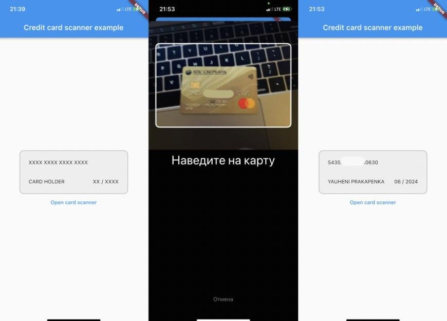

# Flutter Credit Card Scanner

Credit card scanning for Android and iOS.

## iOS

<p align="center">
  <p style="text-align:center;">
</p>

The library is used [CreditCardScanner](https://github.com/yhkaplan/credit-card-scanner), which works with Apple's Vision API from `iOS 13.0` and above.

## Android

<p align="center">
  <p style="text-align:center;">
</p>

The library is used [card.io](https://github.com/card-io/card.io-Android-SDK), from `Android 4.1` and above.

## How it's set up

### iOS

- For `info.plist` added camera resolution
```
<key>NSCameraUsageDescription</key>
<string>The app requests access to the camera to automatically scan the map</string>
```
- Added library

credit_card_scanner/example/ios/Runner.xcworkspace -> while navigating Runnter -> справа Project Runner -> Packages Dependencies -> +

```
https://github.com/yhkaplan/credit-card-scanner.git
```

- Installed CocoaPods
```
cd example/ios
pod install
```

### Android

- android/app/build.gradle two dependencies added
```
dependencies {
    implementation 'io.card:android-sdk:5.5.1'        
    implementation 'com.google.code.gson:gson:2.8.9'
}
```

Fork https://github.com/yauheniprakapenka/card_scanner_v1